# A-X-M · Ally XMB Menu

A PS3-XMB-style hub for the **ROG Xbox Ally** (and any Windows handheld or PC), built with
Electron + TypeScript. Games, music, photos, video, Jellyfin, a browser and settings in
the cross-media bar you remember, driven from the controller, with the waves and the
sounds.

> **Beta.** First public build. Expect rough edges; issues and ideas are welcome.
> Possible **PSP** and **Android** development coming soon.

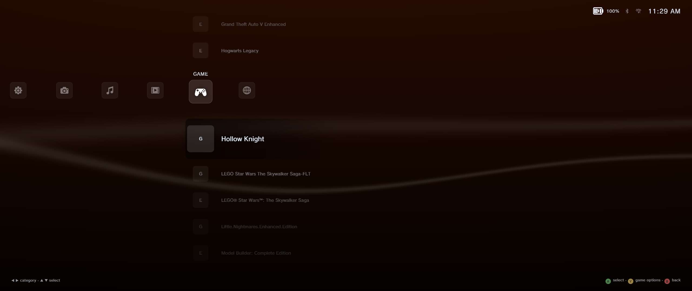

## Download

From the [Releases](https://github.com/nahalewski/A-X-M/releases) page:

- `A-X-M-Setup-<version>.exe` - installer (NSIS, per-user, no admin needed)
- `A-X-M-<version>-portable.exe` - portable, runs from anywhere (a USB stick, a games drive)

**Runs on:** Windows 10 / 11, x64 (AMD Ryzen Z-series, Intel Core / Core Ultra, any 64-bit
desktop or laptop CPU). ROG Xbox Ally, ROG Ally / Ally X, Legion Go, MSI Claw, Steam Deck on
Windows, and any PC with a WebGL 2 GPU. No ARM64 build yet (Snapdragon X runs it through
Windows' x64 emulation). Full list in [docs/ROADMAP.md](docs/ROADMAP.md).

Windows SmartScreen warns on first run because the build isn't code-signed - *More info › Run anyway*.

## Demo

[▶ Watch the 84-second demo (MP4, 5.5 MB)](docs/A-X-M-demo.mp4) - profile creation, an
avatar, music with the visualizer, a photo, a video, a scroll through the games, and
changing a game's artwork.

## Features

### The menu
- The XMB, in the PS3's running order: **Users · Settings · Photo · Music · Video · Game · Browser**, with
  the sliding category bar, PS3-style icons, the boot sound, the ambient loop (five loops to
  choose from, or off) and the navigation sounds.
- Animated ribbon background over the XMB's own month colours (January grey through
  December red), or a **wallpaper** from your own pictures (one, or a folder shuffled).
- **Controller first**: Xbox pads, the Ally's own controls, PlayStation, Nintendo Switch and
  Razer Kishi pads - the footer hints draw the face button as *your* pad draws it.
- **In-game overlay**: the Guide / PS button (or M1 mapped to a shortcut) brings the menu up
  translucent over whatever's running, and drops it again.
- Runs at the display's refresh rate (60 / 120 / 144 or match display) and at the
  **resolution you pick**: 720p, 800p, 900p, 1080p, 1200p, 1440p, 1600p, 4K, or *Auto*, which
  reads the screen and the GPU. Optional FPS counter and hardware readout.
- First-boot profile with three avatar sources (bundled avatars, SteamGridDB, your game
  icons) and a PS5-style welcome sparkle.
- Wi-Fi, Bluetooth, the Ally's battery and an Anker power bank in the status bar.

### Game
- Scans every drive: Steam, Epic, Xbox / Game Pass, GOG-style folders and any folder you add.
  Only real games show - launchers, redistributables and tools are filtered out.
- Cover art and hero backgrounds from Steam and SteamGridDB; **Change Artwork…** picks any
  cover SteamGridDB has for the game.
- Y on a game: Lossless Scaling profile (1–3), open its folder, change artwork.
- Your Steam library with install state and progress; installs run in the background and
  Steam's dialog is confirmed for you (hands-off, optional).
- Saved Data Utility and Game Data Utility, like the PS3's.
- Launcher rows for Steam, Epic Games, Battle.net, GeForce NOW and Xbox Cloud Gaming.

### Music
- Browses your music folder-by-folder, plus any drive's `MUSIC` folder.
- **Playlist**, **shuffle**, play/pause from anywhere, now-playing bar.
- **Song Information** (Y): the file's tags and cover, MusicBrainz artist details, Cover Art
  Archive covers.
- **Eleven visualizers**: the PS3's Spectrum Analyzer, Earth, Line and Waveform; the PSP's
  Rain, Circle and Sparkle; and Tunnel, Terrain, Scope and Pulse - all in one neon palette.
  ◀ ▶ switches on the stage; the one you pick stays behind the menu while music plays.

### Photo and Video
- In-app viewers: photos zoom, rotate and slideshow; MP4 video with seek. Controls drawn from
  PS-style button sheets.
- **Jellyfin**: finds servers on the LAN (or type an address), signs in once, browses your
  libraries with posters and backdrops, plays in the menu (direct play when the browser can,
  HLS transcode when it can't), and **downloads** films and episodes to any drive.
- **Information** (Y) on a film or show from TMDB (your own API key).
- **Copy** songs, pictures and videos to any drive's `MUSIC` / `PHOTO` / `VIDEO` folder and
  back to this PC; make folders inside them from the menu. A drive with those folders gets
  its own row, and keeps a greyed row when it's unplugged.

### Browser
- A pop-up browser **inside** the menu (not Edge): D-pad scrolls and moves through history,
  Y reloads, B closes; Google, YouTube TV, Xbox Cloud Gaming and GeForce NOW one press away.

### Settings
Grouped like a console's:
- **Theme** - monthly XMB colours, ribbon speed / width / colour, visualizer style, welcome
  sparkle, wallpaper.
- **Display** - fullscreen / windowed, background quality, **menu resolution** (720p–4K, auto),
  **menu upscaling** (FSR-style sharpening when rendering below native), refresh rate, FPS
  counter, hardware readout, battery percentage.
- **Audio** - volumes, menu music (five loops or off), navigation sounds, shuffle, music folders.
- **Network** - **Wi-Fi** networks in range: join (password on the on-screen keyboard),
  disconnect, forget; **Bluetooth**: paired devices, pair / remove - all without leaving the
  menu (discovery is best effort, see the roadmap).
- **System** - System Information (device, CPU, RAM, GPU, every drive's used / free space),
  Controller (players 1–4, wired / wireless, battery, A/B profile, dead zone, vibration), Steam
  hands-off install, Steam install drive, in-game menu button, game folders, rescan.
- **About**, Exit.

## Screenshots

| | |
| --- | --- |
| 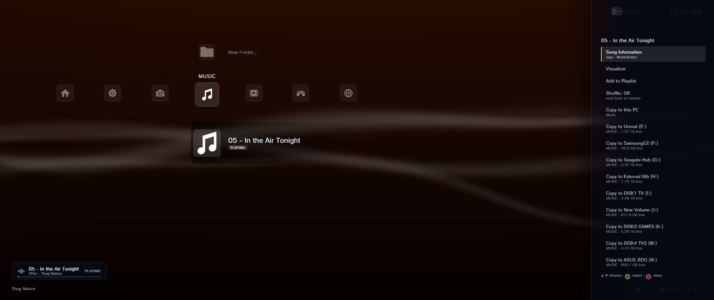 | 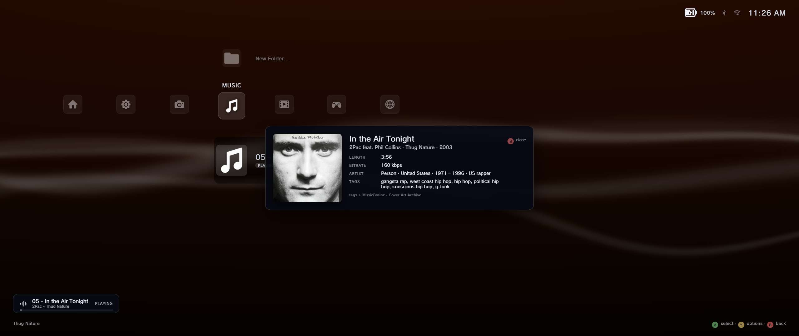 |
| 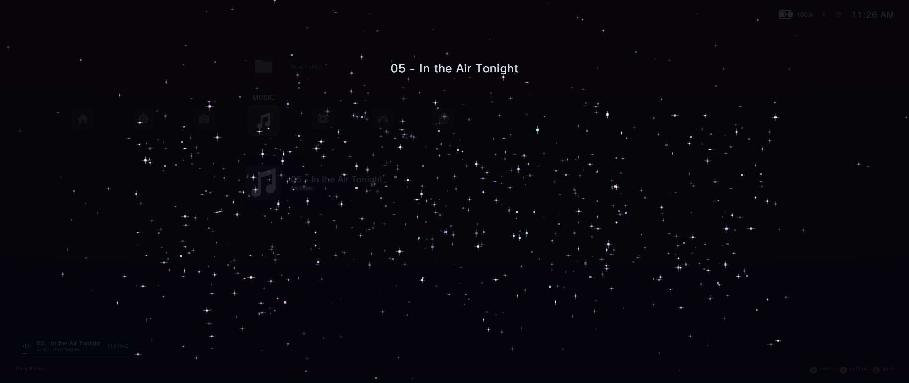 | 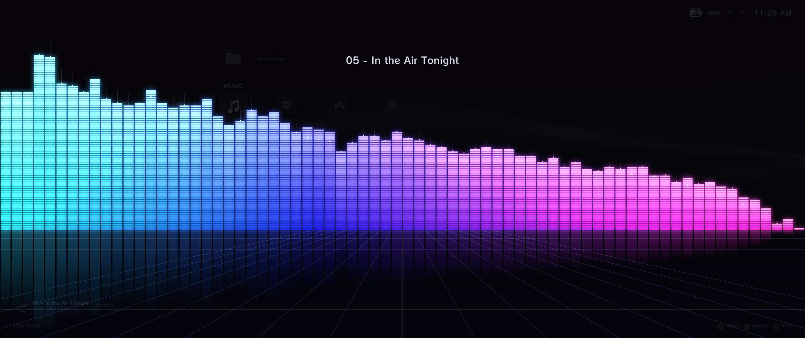 |
| 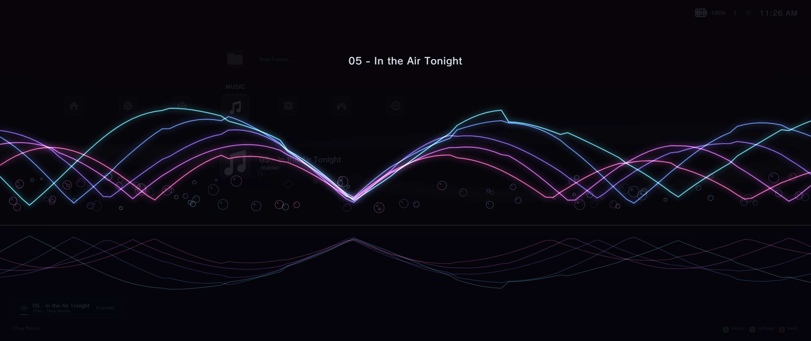 | 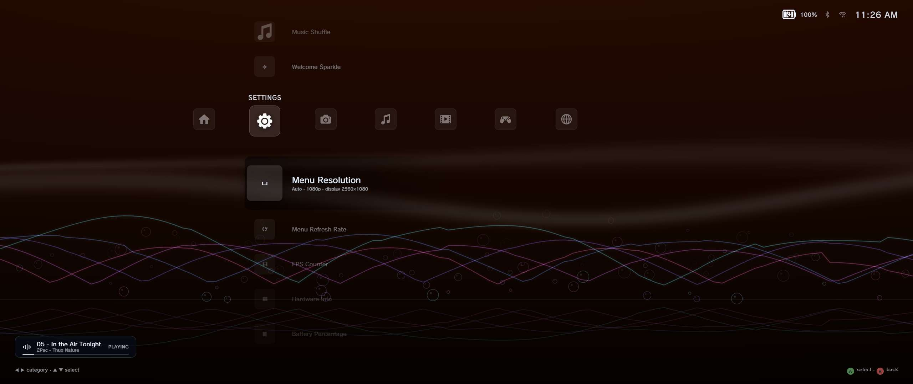 |
| 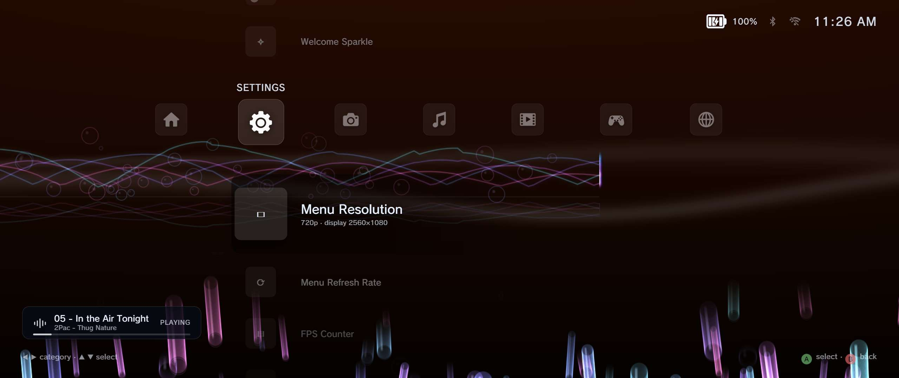 | 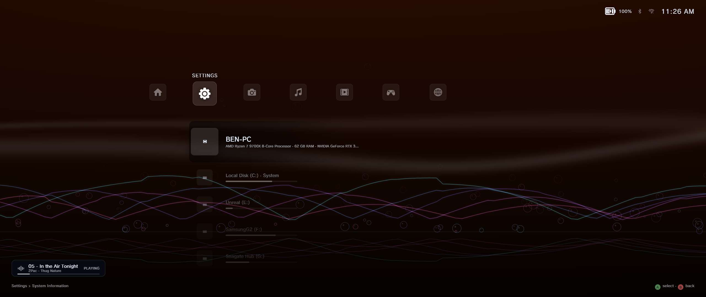 |
| 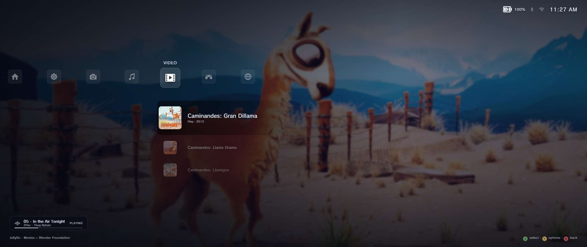 | 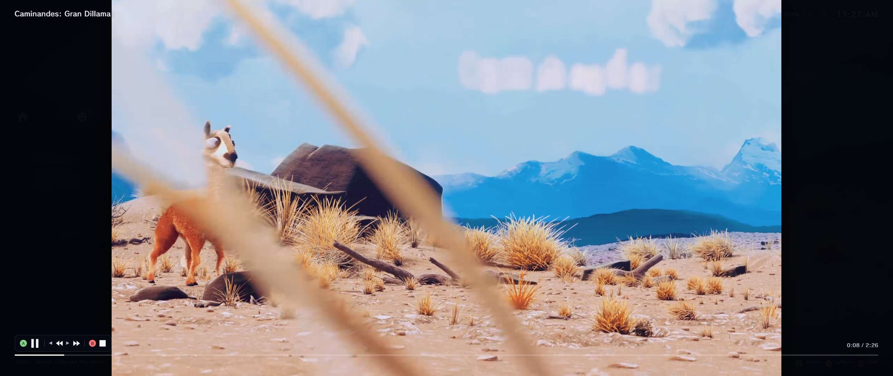 |

## Resolution and performance

The window always covers the display's physical pixels. **Settings › Menu Resolution** picks
the height the menu is laid out and rendered at: at *720p* on a 1080p screen the layout is
720 rows tall and the ribbon and visualizer draw their frame buffers at 720 rows, then the
compositor scales up - so a weaker GPU does less work and the UI reads larger. *Auto* uses the
native height, stepping down to 1440p or 1080p when the GPU reports little memory. Anything
between 720p and 4K is offered up to the display's own height, which covers the Ally (1080p),
Steam Deck-class 800p panels and 1440p / 4K docks.

**Menu Refresh Rate** caps the ribbon at 60 / 120 / 144 fps or follows the display. The menu
itself is vsync-locked to the panel.

**Menu Upscaling** - *Off*, *Sharpen* (FSR-1-style contrast-adaptive sharpening) or
*Sharpen+* - is applied to the scaled-up background layers when the menu renders below the
panel. It's a sharpening pass, honestly labelled: FSR 3.1 and DLSS need a game engine's
motion vectors and depth buffers (and, for DLSS, NVIDIA's runtime), so they can't be applied to
an Electron window. Games launched from the menu use whatever upscaler they support.

## Bugs and roadmap

Known limits and what's planned are in [docs/ROADMAP.md](docs/ROADMAP.md).

## Run from source

```bash
npm install
npm start
```

`npm start` builds everything and launches the app; `npm run dev` also opens DevTools.

## Build the installer

```bash
npm run package
```

Output goes to `release/` (an NSIS installer). The packaged app never contains your API keys:
SteamGridDB and TMDB keys live only in `%APPDATA%\A-X-M\axm-settings.json`.

## Keys and accounts

- **SteamGridDB** (game art): `gameArtApiKey` in the settings file, or the
  `AXM_STEAMGRIDDB_KEY` environment variable.
- **TMDB** (film / show information): `tmdbApiKey` in the settings file.
- **Jellyfin**: sign in from the Video column; only the access token is kept, never the password.
- MusicBrainz and the Cover Art Archive need no key.

## Controls

| | Xbox | PlayStation | Keyboard |
| --- | --- | --- | --- |
| Move | D-pad / left stick | D-pad / left stick | Arrows / WASD |
| Select | A | ✕ | Enter |
| Back | B | ○ | Esc / Backspace |
| Options | Y | △ | Y |
| In-game menu | Guide | PS | Alt+Home (configurable; map M1 to it in Armoury Crate) |

## Credits

Developed with AI as a passion project - see *Settings › About*. Icons, sounds and sprite
sheets are credited in `assets/THIRD_PARTY_LICENSES.md`. Not affiliated with Sony, ASUS,
Microsoft, Valve, Epic, Jellyfin or TMDB.

## Ribbon background

The animated background is an original real-time effect - no video, no GIF, and no
console firmware assets or shaders. Layered translucent ribbons bend along their
length, twist about their own axis and drift through depth, over a deep gradient
backdrop that cycles colour.

### Dependencies

```bash
npm install three
npm install -D @types/three
```

Nothing else. esbuild already bundles it into `dist/renderer/main.js`.

### Files

| File | What it holds |
| --- | --- |
| `src/background/RibbonBackground.ts` | Public API, animation loop, FPS monitor, WebGL/Canvas selection |
| `src/background/RibbonRenderer.ts` | Three.js scene: ribbon meshes, backdrop quad, camera |
| `src/background/ribbonShaders.ts` | Vertex and fragment GLSL for the ribbons and the backdrop |
| `src/background/ribbonFallback.ts` | Canvas 2D renderer used when WebGL is unavailable |
| `src/background/ribbonTypes.ts` | Options, quality presets, per-layer tuning, backdrop palette |

### Electron integration

It lives entirely in the **renderer** process. It touches WebGL, the DOM and
`requestAnimationFrame`, none of which exist in the main process, and it uses no Node
APIs, so it runs unchanged under `contextIsolation: true` / `nodeIntegration: false`.
It is created in `src/renderer/main.ts` right after settings load:

```ts
const ribbon = new RibbonBackground(document.getElementById("background-layer")!, {
  color: "#ffffff",
  opacity: 0.22,
  speed: 0.25,
  layers: 4,
  quality: settings.backgroundQuality,
  glow: true,
  backdrop: "cycle",
  backdropCycleSeconds: settings.waveColorCycleSeconds,
});
ribbon.start();
```

The full API is `start()`, `stop()`, `resize()`, `destroy()`, plus `setColor`,
`setOpacity`, `setSpeed`, `setLayers`, `setWaveStrength`, `setGlow`, `setQuality`,
`setAnimating`, `setBackdropCycleSeconds`, `setInteractivity`, and the optional
`onNavigate()` / `onSelect()` hooks. `destroy()` removes every listener, disposes the
geometry, materials and GL context, and drops the canvas.

The component needs no explicit cleanup in this app, because the window and the
renderer die together, but `destroy()` is required if you ever rebuild it.

### Layers

The UI stacks as `#background-layer` (0), `#game-bg` (1), `#app` (10),
`#context-modal` (20), `#boot-splash` (30). `#background-layer` is
`pointer-events: none`, so the ribbon never intercepts controller, keyboard or mouse
input. `#app` is the UI layer the component spec calls `#ui-layer`.

### Quality and frame rate

Motion is time-based throughout, driven by the elapsed seconds between frames rather
than a frame count, so 60, 90 and 120 Hz all produce identical speed.

| Preset | Layers | Segments | Max DPR | Glow |
| --- | --- | --- | --- | --- |
| Low | 2 | 48 | 1 | off |
| Medium | 3 | 96 | 1.5 | on |
| High | 5 | 176 | 2 | on |

`quality: "auto"` starts at high and steps down a preset whenever the average stays
below 55 FPS for three seconds. It never steps back up: a machine sitting near the
threshold would otherwise flip presets every few seconds, and that churn is far more
visible than the frame it saves. Settings > Background Quality overrides it.

Rendering pauses entirely while the window is hidden or minimised.

### Tuning

Nearly everything lives in `src/background/ribbonTypes.ts`.

- **Softer**: raise `thickness` in `LAYER_SPECS`, or lower `opacity`. In the fragment
  shader, lowering the `pow(band, 1.35)` exponent widens the falloff.
- **Sharper**: raise that exponent, and raise the `core` multiplier on `uGlow`.
- **Faster or slower**: `setSpeed()` scales everything at once. For a single band,
  change its `speed` in `LAYER_SPECS`.
- **Wider waves**: lower `frequency` for fewer, longer undulations. Raise it for a
  tighter ripple.
- **Taller waves**: raise `amplitude`, or `setWaveStrength()` for all layers. Past
  about 1.6 the bands start colliding.
- **More layered**: add entries to `LAYER_SPECS` and raise `maxLayers` in the quality
  profiles. Keep new layers' `depth` spread out, since that is where the parallax
  comes from.
- **More twist**: raise `TWIST` in `RibbonRenderer.ts`. Zero gives flat stripes.
- **Backdrop**: edit `BACKDROP_PALETTE`, or pass `backdrop: "static"` with
  `backdropColors`, or `backdrop: "none"` to leave the container transparent.

### Interactivity

Navigation boost, selection pulse and pointer parallax are all implemented but
**disabled by default**, as specified. Turn them on with:

```ts
ribbon.setInteractivity({ enabled: true });
```

then call `ribbon.onNavigate()` as the selection moves and `ribbon.onSelect()` when a
game is chosen.

## Menu background

Selecting a game swaps the animated wave for that game's wide hero banner, blurred
and darkened behind the menu, the way a PS3 theme replaces the XMB background.
Moving to another game crossfades; leaving the Game category fades back to the wave.

Steam titles use Steam's own `library_hero.jpg`. Everything else is looked up on
SteamGridDB with the same key as the box art, and cached next to it in
`%APPDATA%\A-X-M\art-cache`. Games with no hero available simply keep the wave.

## Still needed before this is "done"

1. **Verified Lossless Scaling automation** - currently A-X-M just launches LS and lets
   its own per-app auto-scale filters (which you configure inside LS) do the switching.
   Real automatic profile writing needs LS's `Settings.xml` schema verified against an
   actual install before it's safe to touch.
3. Game-cover art for Epic/generic/Xbox entries (Steam already pulls library art from
   Steam's CDN); Xbox tiles use the UWP package logo when one resolves.
